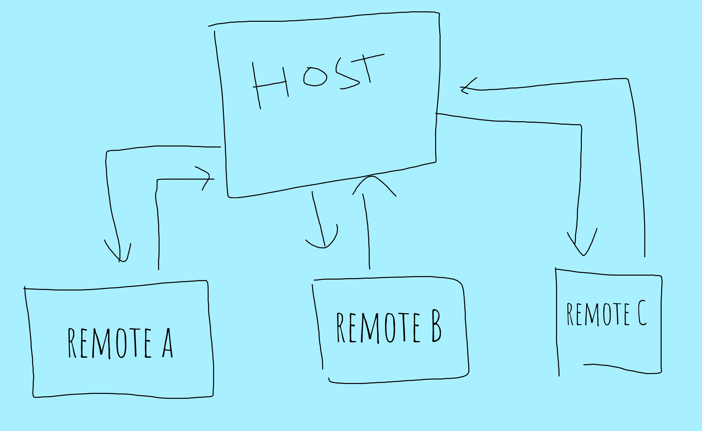
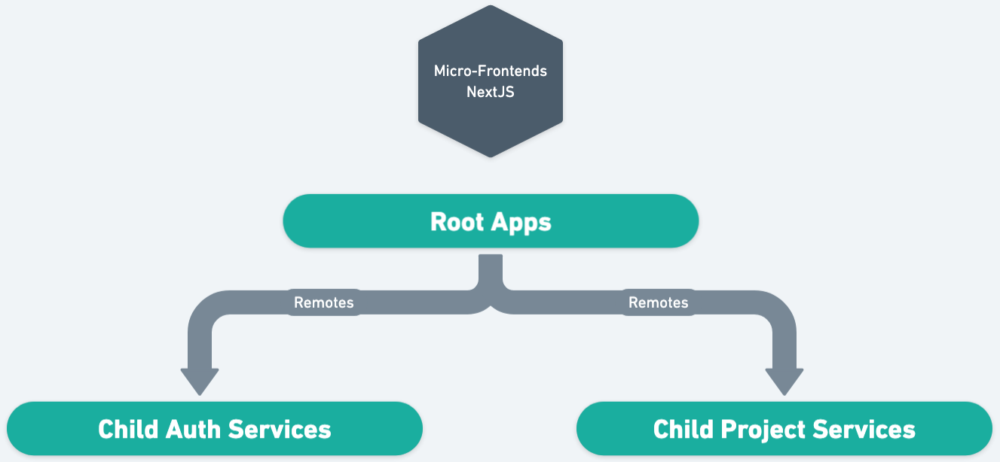

# Micro-FrontEnd Next.JS Using ModuleFederation
**Webpack Module Federation (MF)** is a feature of webpack that allows for the dynamic loading of multiple versions of a module from multiple independent build systems. (https://module-federation.io/)

## Architecture Projects

## Spesification
- Next.JS 14
- Page Router
- TailwindCSS

## Installation
1. **child-project-app**
- `npm install`
- `npm run dev`
2. **child-auth-app**
- `npm install`
- `npm run dev`
3. **root-app**
- `npm install`
- `npm run dev`

## Run
This project will run on the `http://localhost:3000`